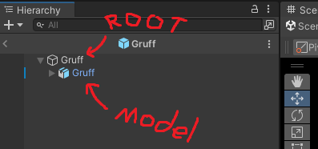

# Adding a new character

This guide assumes you have run through the new project guide and have a working example scene, this guide does not include adding the parts necessary to make a predator (player or NPC) character.
You can find how to do that on its own in another guide but this guide will be a required step to reach that point.

# Part 0 - Quick notes

Before we start I want to make note that all characters in churn vector have a layer of clothing which can be 'stripped' from them through a few means ingame, if your character has clothes
that you want to be able to strip off like this, you will need to export them from blender as two separate meshes. One with the clothes and one without them.
This won't alter any of the steps you take other than telling the game "this character has clothes".

If your model has no clothes or only clothes and no naked variant then you can simply not define the clothing values that we will do later in this guide and it will simply
keep the model as is instead of trying to swap between a clothed and naked version.

# Part 1 - Importing the character

In order to work properly, your character will need to be a single mesh renderer per clothed/naked variant, this means before exporting you need to join everything on your character so that when you select it in your editor of choice they are considered one object. 
If you have a clothed and naked variant these should be independent from eachother but contain everything for each state in them.

So for example, if I have a clothed kobold and a naked kobold, the clothed kobold needs the clothes and the body mesh as one object and then the naked kobold needs just the body, so i will have two bodies that are separate from one another and one of them will also have clothes as part of the object.
Similarly if I only have a naked kobold, then I just need the body.

> When exporting your model make sure you export the two (or one) bodies and the armature together. This means if you have a character thats going to be stripped naked ingame you are exporting both of the meshes at the same time as a single .fbx

Export your character as a .fbx from your model editor of choice and bring it in to the unity project (drag and drop it into your project window)
Likewise, drag any textures, normal and mask maps into the project (Make sure to set any normal maps as type "Normal Map" in the inspector for that file once in unity!)

> We use Unity standard maps for materials, if you have substance painter select Unity Hd pipeline metalic standard as your export
> Depending on what you have, you may need to alter your textures to work with this but worst case just only import the base colors and fix the rest later)

Once imported, select the model from the project window and in the Inspector panel, open the rig tab.
Click on the Animation Type dropdown and select "Humanoid" then click Apply

Once applied, click on Configure to enter Avatar Configuration and make sure all of the bones that your model has are set up in the correct slots
Scroll down and under Pose select "Enforce T-pose"

> Note that our game does not use the fingers or toes in any animations. If your character has these you may want to pose them in the Avatar Configuration window to be in an idle pose rather than perfectly T-posed

Once in a T-pose you will need to do some fitting, the character will likely have imported not at a zero point so, to make this simple go to the top menu, click on GameObject->3D Objects->Plane to insert a flat plane into the view.
Select the plane and then, in the Inspector panel, scroll down to the bottom and change the Position to be 0, 0, 0
Click on the hip bone of your avatar and use it to move them up and down so that their feet are placed on the plane. Once done, delete the plane.

Click apply and then Done to return to the example scene.

# Part 2 - Configuring Materials

Now that the avatar is imported as a humanoid we need to extract the materials to use the ones Churn Vector does
Go back to the imported model and open the Materials tab, click on "Extract Materials" and place them in a new folder named "Materials"

If you brought in the textures prior to this, the materials should automatically have picked them up, if not just drag and drop them from the textures file into the materials as you go.
For now we will only worry about the characters body textures and such, no naughty bits.

Setting materials up is as follows:
1) Click on the material and in the Shader dropdown at the top of the inspector and find the shader named CockVoreSlurp
2) Check that the BaseColorMap is defined, if not drag it in (Lock the inspector via the lock icon in the top right to prevent the inspector deselecting the material)
3) Do the same for the other maps you have that the material accepts (Remembering to unlock and re-lock the inspector as you go)
4) Don't change any of the other settings, these are mostly controlled by the game and you can experiment with them later

Once all of the materials are set up, Right click in your project window and create a new Prefab.
Open the prefab by double clicking on it. Drag your imported model in from the project window and then, in the inspector, set their X and Z position to 0 and the Y position to -1.

> If you have a naked and clothed version these will be clipping through eachother currently, go ahead and expand the Hierarchy to show your armature and meshes. Click on the naked mesh and then in your inspector window click on the tick next to the name in order to disable it. We will configure the clothing values in Part 2 to toggle between the clothed and naked version by programatically enabling and disabling meshes like this.

Back out of the prefab by clicking the arrow on the Hierachy or the name of the scene in your scene window.

# Part 3 - Making the character prefab work with character loaders

In Churn Vector, all characters are spawned into the world via the character loaders. In the example scene you can see these as cardboard cutout characters.
In order to make your new character able to be spawned from one of these loaders they need a few components attached to them which we will now do

To start with, open the prefab you made via the Project window and in the Heirachy panel you should see the prefab itself and then underneath it, your character.

In order to make the process of setting up your character easier, lets reference an existing one in the SDK!
Navigate your project window to `Packages/Churn Vector SDK/BuildIn/Characters/Gruff` and drag the gruff prefab (the one with the solid blue box before its name, not the one with the zipper on it!) into the scene.
This is only temporary but this will allow you to check how Gruff is set up without having to repeatedly change the prefab you are viewing!

Note that even though the Gruff prefab will appear underneath the root element of your prefab, they have the same structure as you will and if you click on the arrow to drop them down you will see they also have a root element containing the actual character element underneath it.

### Root component setup

Click on the Gruff prefab in the Hierarchy and look at the Inspector window, you will notice this character has a Civilian script component and a Decalable Collider component.
Click back onto your new characters prefab (the root element in the Hierarchy) and click "Add Component" then search for those two components and add them.

> In the following list you will be asked to select elements from a few search menus, sometimes the elements in the search window will be hidden by default, if that happens there will be a crossed out eye icon in the selection windows menu that you can click on to disable hiding.

To configure the Civilian script:
1) Volume Solid is how large they should make the players "assets" when first consumed - The default of 8 is a good value for very large characters where someone small like Gruff is good at around 4.
2) Volume Churned is the same as above but once churned, this should usually be about 1/4 of the solid value but its up to you if you want to follow that or not.
3) The Dialogue theme - Click on the rightmost circle to open the selection menu and pick a Dialogue theme for their speech lines (you could add a custom one if you want but thats for another time!)
4) Balls - don't touch this section just yet, this is for setting up the characters naughty bits that we aren't using in this guide
5) Head Sprite - this is the icon that appears on the players HUD after ingesting a character and what shows up on their condom. If you don't have any art of your character and don't want to draw some yourself, just take a screenshot in blender and use that! (If you want to do that later just pick an existing one for now)
6) Speed is the rate at which a character moves. Generally its a good idea to keep this under the players base move speed (2.8) so that they can catch up to your character while undetected
7) Animation Group - this is a group setting used by some animation stations to play different animations depending on the characters animation group. This is currently a work in progress but  we use "Tall" to play some special animations for the giraffe right now!
For now you will probably want to not touch this unless your character fits one of the pre-defined groups here.
8) Taser output - Again this is probably not for now, just ignore this value

To configure the Decalable Collider
1) Open the renderers list and click the + icon (click it twice if you have a clothed variant)
2) Drag and drop the mesh from the Hierarchy onto the now empty slot in the list (this should be under the character model in the Hierarchy, drop down the list until you can see the Armature and your mesh will be on that same expanded layer)
3) Do this again if you have a naked/clothed variant so that you have two elements in the Renderers list (or just one if you only have one version)

### Character component setup

Clicking once again on the Gruff prefab in your Hierarchy, drop down so that you can see the second element in Gruffs prefab and click on it. This is the imported .fbx of gruff that contains the Animator component.
You will notice that there are far more components on this object than the base prefab, thats ok because for now we will only be using the Animator, Character Animator Controller and Jiggle Rig Builder for now.

So to start with, lets go back to your new character and instead of the root element, click on the second element (which is the character itself) and:
1) Click on the circle in the Controller section of the Animator and choose "Player Controller" (If there is nothing to choose, click on the slashed eye icon in the top right of the popup window or search for it)
2) Untick the Apply Root Motion field in the Animator
3) Add the Character Animator Controller script component
4) Add the Jiggle Rig Builder component

We will now fill out a bunch of values, don't worry if you don't know exactly what all of these do as I'm going to skip over a bunch of them that are not relevant right now.

1)  Xray Body renderers - drop this down and click the + and then either drag the body mesh from the Hierarchy (specifically the naked body mesh) to this new element or hit the circle and pick it from the list.
2) If you have a clothed variant, set the Cloth Rip Pack to "ClothRip"
3) // Cloth Rip Asset to "ClothRip"
4) // Cloth Texture to the texture you used for your characters clothes (if they are atlased to the body just pick it anyway, its not terribly visible)
5) // Cloth Color to the primary color of your characters clothes
6) Naked Body Renderers - Drop this down, click the plus and put your characters naked body here via dragging or circle menu, if you only have one mesh then use this for it.
7) Clothed Body Renderers - If you have a clothed and naked variant, put the clothed mesh here as you did the naked one above
8) Boob Oomph Effect - This is used to make body parts kind of burst out of clothes instead of just appearing, if your character has breasts or some other jiggly physics object (which we will configure later) you can add the bones from the armature here to make this happen. To select them either drop down the Armature in your Hierarchy until you find them or click the circle and search for them
9) Bounce Curve - This is used to control the above, set it to MediumBounce for now, you can make a custom value later if you so choose but this works fine for us.

The rest of the values here are for predator settings and being used as a 'use station' which are not covered in this Guide

Setting the Jiggle rig settings is purely for enabling physics on elements such as ears, tails or anything else you want to wobble and shake when the character moves.
As an example, lets give our characters tail some physics:
1) Drop down Jiggle Rigs and add a new entry
2) Open the new entry and under Root Transform, select the tails root bone
3) Under Jiggle settings for that entry select "DragonTail"
4) Back on the component itself, under Level of Detail choose "JiggleRigSimpleLOD" - this controls how far away the physics renders for the player
5) Make sure Interpolate is ticked

With all of this done, delete the Gruff prefab we brought in earlier as you should no longer need to reference this (It will also break things if left in your prefab). Make sure you delete Gruff entirely and don't accidentally leave their root element in the Hierachy.

This should be everything you need to do so, to test everything worked, click on the character loader in the example scene (cardboard cutout looking object) that is not the player loader (just click them both until you find the one that isn't listing "player" in the inspector)
Drag the prefab you have created into the loaders Civilian Prefab field and hit play, the game should load up and place you as the bunny in the world with your new character walking back and forth between some needs stations (which are currently too low and cause characters to be in the floor slightly).

Congratulations, you have imported your character into the game with all of the necessary components for them to be turned into a fat load! (You can even play as them if you change the player loader to use the new characters prefab but you won't be able to vore anyone just yet)

An important note here is that this will not add your character to any existing maps in the game as they are considered a new prefab rather than over-writing an old one.
In order to do this please refer to the Mod Profile section of the new project document!

### FAQ
#### My character is digitgrade and the animations make their legs break

This is because Unity's humanoid rig expects just that, a human. In this case this is the same problem that every VRChat player with legs that aren't perfectly straight have encountered and in order to fix this you simply need to add some extra bones and add rotation constraints to the digitgrade ones.
Its a slightly complex topic to get right and requires a bunch of images so just go google how to do digitgrade legs in unity and you should find a pretty straightforward guide (Kaideart has a really nice one!)

#### My character is floating or in the floor

This happens when the character or the needs station they are using are not set to the right height - if the character walks around fine and then sinks into the floor during a needs station thats fine, you didn't do anything wrong it just means the needs station is positioned incorrectly.

If however your character is floating or under the floor while walking between needs stations then this is an issue with the character, either you didn't align them right in the avatar configuration menu or you forgot to set their y transform to -1, go check back up the top of the guide as it outlines how to do this.

#### My characters jaw is open

This happens if you exported your model with the jaw open rather than closed, the easiest solution to this is to go back into the avatar rig configuration, remove the jaw bone and then in the prefab, rotate it to be closed.
The better fix would be to go back to your 3d editor of choice and set the mouth being closed as the default pose of the avatar but this can be complex to do if the model is already finished and has blend/shape keys so don't worry too much if you can't do that.
