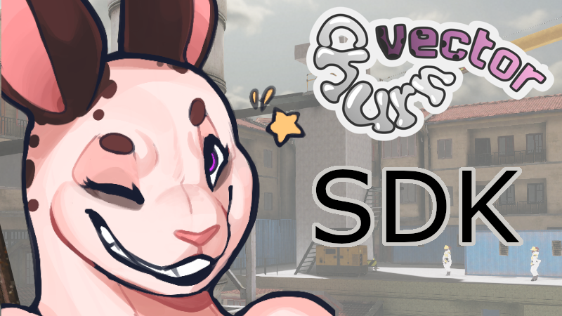

# Churn Vector SDK

This is a work-in-progress SDK for Churn Vector. It's hopefully going to provide everything needed to create and test content.

It's **not functional** right now as we're still working it out!

# Licensing
Churn Vector is built out of many pieces, each piece might be licensed to you differently if at all.
*Please check carefully* if you have rights to use assets contained within.

If something isn't clearly licensed, it is All Rights Reserved.

- Most code available in this SDK is under GPLv3, check the top of each file to be sure.
- Most models are Attribution-4.0-NC.
- Sounds are organized depending on their associated license into folders. Attribution sounds are from freesound.org with their original id_username_filename format.

# Installation

This package on its own will allow you to 'run' churn vector locally with a few considerations and missing assets (namely levels, any assets we haven't released and paid assets that we can't distribute)

To get started, clone this repository via git and then head over to the Modding Guides folder either here or on your machine. The guides are written in Markdown which github automatically formats so you may have an easier time viewing it here.

Start with `ModdingGuides\NewProject.md`, each guide will tell you what you need to have done prior so don't worry about accidentally reading the wrong guide early!
